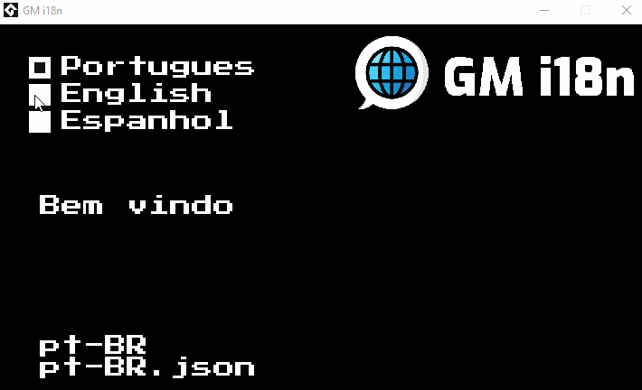

<h1 align="center">
    
</h1>

<h4 align="center">Internationalization of texts simply and quickly, using JSON files</h4>

<p align="center">
  <a href="https://github.com/CreativeHandOficial/gm-i18n/releases/tag/v0.1.0">
    
  </a>
  <a href="https://twitter.com/intent/follow?screen_name=CreativeHandOf">
    
  </a>
</p>

---

## Sample demonstration

<br />

<p align="center">
    
</p>

---

## Usage

To use GM i18n, download [the latest release](https://github.com/CreativeHandOficial/gm-i18n/releases), and import the `.yymps` package into your project.

Location files must be included in the GMS include file. Example of how to create a file: [en-US.json](https://github.com/CreativeHandOficial/gm-i18n/blob/master/datafiles/en-US.json)

Once imported to your project, you can use any of the API functions below. Remembering that it is necessary to configure `gmi18nSetup();`

---

## API

### `gmi18nSetup(_locales*, _defaultLocale*, _fallBackLocale)`

This function is responsible for configuring the creation of the locations configuration file, defining what will be the default location and configuring the return location.

```
@desc Method for configuring in18 within your project, using locations as parameters. The default location. And a return location if there is no requested structure.
@param	{array}  _locales*		    Required Locales configuration array, must contain code, file and lang
@param	{string} _defaultLocale*  Required Setting the default location
@param	{string} _fallBackLocale  Optional Setting the return location, if it does not exist at the current location
@example

// Configuring gmi18n to generate the information needed to initialize it.

locales = [
	{ code: "pt-BR", file: "pt-BR.json", lang: "Portugues" },
	{ code: "en-US", file: "en-US.json", lang: "English" },
	{ code: "es-ES", file: "es-ES.json", lang: "Espanhol" }
];

defaultLocale = "pt-BR";
fallBackLocale = "pt-BR";

gmi18nSetup(locales, defaultLocale, fallBackLocale);
```


### `useTranslation(_param)`

This function is responsible for returning the text that was configured in the json file of the chosen location

```
@desc Method responsible for returning the text within the .json file of the previously chosen location
@param	 {string} _param Structure created within your .json localization file
@returns {string} Returns the text chosen in the parameter
@example

// Search for the welcome text according to the chosen location
draw_text(x, y, useTranslation('welcome'));
```

> Recommendation

It is possible to abbreviate the `useTranslation()` call, to make the code less verbose.

Example:

```
// Create
t = method(self, useTranslation);

// Draw
draw_text(x, y, t('welcome'));
```


### `switchLocale(_locale)`

Change your current location

```
@desc     Method responsible for making the language localization change
@param    {string} _locale* Required Location to be changed
@example

// Changing the language to pt-BR

switchLocale("pt-BR");
```

### `getCurrentLocale()`

Returns the current location code

```
@desc    Returns the current chosen location
@returns {string} _locale Return the code
@example

// Returns the current code: "pt-BR"

getCurrentLocale();
```

### `getLocales()`

Returns an array with all the locations configured during setup

```
@desc    Returns an array with all the locations configured during setup
@returns {Array} _locales Return all locations configured in the setup
@example

// Returns the following array:
// [
//  { code: "pt-BR", file: "pt-BR.json", lang: "Portugues" },
//  { code: "en-US", file: "en-US.json", lang: "English" },
//  { code: "es-ES", file: "es-ES.json", lang: "Espanhol" }
// ];

getLocales();
```


---
## Author

<div align="left">
  <table>
    <tr align="center">
      <td>Coded By</td>
    </tr>
    <tr align="center">
      <td>
        <a href="https://github.com/rbarbosa95">
          
        </a>
      </td>
    </tr>
  </table>
</div>

---

## Architecture

Only in Portuguese. [Link Figma](https://www.figma.com/file/kDefQdVCSkPiTdrzNoxQDm/GM-i18n?node-id=0%3A1)

---

## License

This project is under license [MIT](./LICENSE).

Done with 💚 by [Creative Hand](https://creativehand.com.br/)
